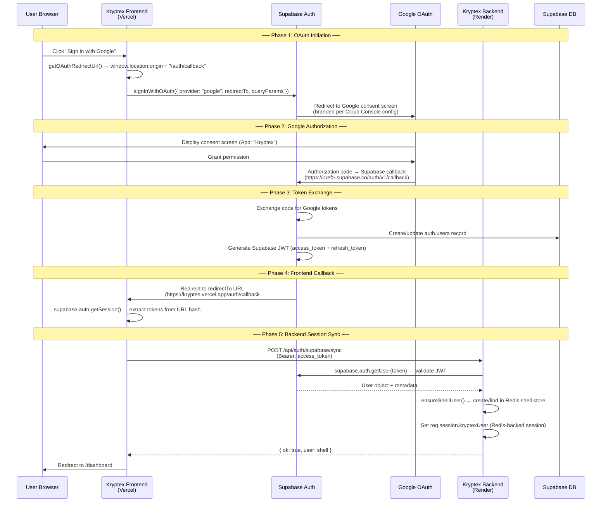
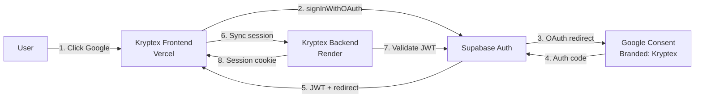
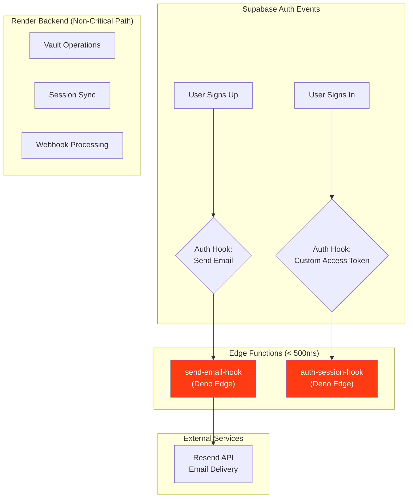
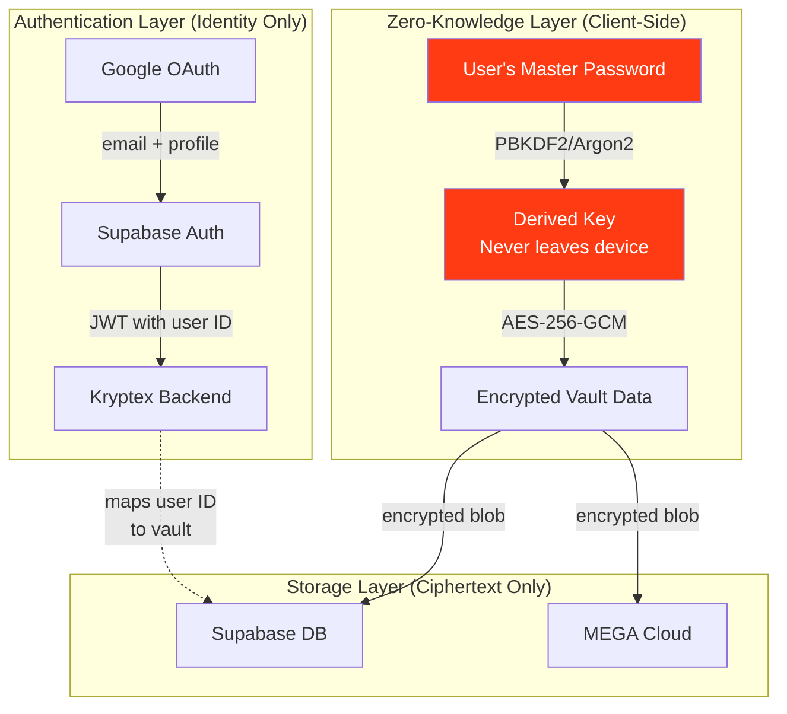

# Kryptex Protocol — Branding, OAuth Handshake Architecture & 502 Incident Report

> **Document ID:** 24  
> **Date:** 2026-04-06  
> **Classification:** Internal Engineering Protocol  
> **Authors:** Infrastructure & Security Team

---

## 1. Branding Specifications

### Application Identity

| Field | Value |
|-------|-------|
| **App Name** | Kryptex |
| **Tagline** | Zero-Knowledge Vault |
| **Primary Color** | `#FF3B13` (Kryptex Red) |
| **Background** | `#FFFFFF` / `#111111` (Light/Dark) |
| **Typography** | Inter, system-ui fallback |
| **Logo Min Size** | 120×120 px (Google OAuth requirement) |

### Support & Contact Emails

| Purpose | Email |
|---------|-------|
| **Google OAuth Support Email** | *(configured in Google Cloud Console → OAuth consent screen)* |
| **Developer Contact** | *(configured in Google Cloud Console → OAuth consent screen)* |
| **SMTP Sender (Resend)** | `Kryptex <onboarding@resend.dev>` (or custom domain) |
| **SMTP Sender (OAuth2 Gmail)** | Via Google Workspace service account |

### Google Cloud Console — OAuth Consent Screen Configuration

The branding that appears on the Google sign-in screen is **entirely controlled by Google Cloud Console**, not by application code. Configure at:

**`Google Cloud Console → APIs & Services → OAuth consent screen`**

| Setting | Required Value |
|---------|----------------|
| App name | `Kryptex` |
| User support email | Your support address |
| App logo | 120×120 px Kryptex logo (PNG/JPG) |
| App homepage | `https://kryptes.vercel.app` |
| App privacy policy | `https://kryptes.vercel.app/privacy` |
| App terms of service | `https://kryptes.vercel.app/terms` |
| Authorized domains | `kryptes.vercel.app`, `supabase.co` |
| Developer contact email | Your developer email |

> **Why it shows "Supabase" or is unbranded:** Google reads the consent screen configuration
> associated with the **Client ID** used to initiate the OAuth flow. Supabase uses YOUR Google
> Client ID (configured in Supabase Dashboard → Authentication → Providers → Google). If the
> consent screen for that Client ID is unconfigured, Google falls back to a generic screen.

---

## 2. Architecture Diagram — OAuth Redirect Flow

### Full Authentication Handshake



### Simplified Flow (Top-Level)



### Auth Hook Edge Functions (Hot Path)



---

## 3. Incident Report: 502 Bad Gateway

### Incident Summary

| Field | Detail |
|-------|--------|
| **Severity** | P1 — Authentication completely blocked |
| **Duration** | Intermittent; consistent after 15min inactivity |
| **Affected Service** | `https://kryptes.onrender.com` |
| **Impact** | Google OAuth callbacks fail, email hooks time out, session sync returns 502 |

### Root Cause Analysis

The 502 Bad Gateway was caused by a combination of **three factors**:

#### Factor 1: Port Binding Conflict

Render injects a dynamic `PORT` environment variable (e.g., `10000`). The reverse proxy forwards traffic to `127.0.0.1:${PORT}`. If the application hardcodes port `4000`:

```
Render Proxy → 127.0.0.1:10000 → ❌ NOTHING LISTENING → 502
Your App → 127.0.0.1:4000  → ✅ Running but unreachable
```

**Fix applied:** `server.js` uses `process.env.PORT || 4000` (fallback `4000` is for local dev only). Verified binding:

```javascript
const PORT = Number.parseInt(process.env.PORT || "4000", 10);
const BIND_HOST = process.env.BIND_HOST || "0.0.0.0";
app.listen(PORT, BIND_HOST, () => { /* ... */ });
```

#### Factor 2: Render Free Tier Sleep Cycles

Render Free Tier instances **sleep after 15 minutes of inactivity**. Cold starts take **30–60+ seconds**. When Supabase's Send Email Auth Hook fires during a cold start:

```
Supabase Hook → kryptes.onrender.com → 💤 SLEEPING → 30s cold start → ⏰ 3s TIMEOUT → 502
```

**Fix applied:** Moved latency-sensitive hooks to **Supabase Edge Functions** (~50ms response time):
- `supabase/functions/send-email-hook/index.ts` — handles email delivery via Resend
- `supabase/functions/auth-session-hook/index.ts` — handles Custom Access Token enrichment

#### Factor 3: Legacy `package.json` Entry Point

The `backend/package.json` had `"main": "index.js"` while the actual server is `server.js`. While Render uses the `start` script explicitly, this mismatch could cause confusion with tooling.

**Fix applied:** Changed to `"main": "server.js"`.

### Additional Hardening

| Improvement | Description |
|-------------|-------------|
| **`GET /ping`** | Zero-overhead health check placed before all middleware. Set cron-job.org to hit this every 5 min to prevent sleep. |
| **`GET /health`** | Lightweight status check including Redis connectivity. |
| **`GET /health/deep`** | Diagnostic endpoint logging port binding, proxy headers, and routing info. |
| **Graceful shutdown** | `SIGTERM`/`SIGINT` handlers close HTTP server and Redis connections cleanly. |
| **Error boundaries** | `server.on('error')` and `process.on('unhandledRejection')` prevent crash loops. |

### Verification Steps

```bash
# 1. Confirm port binding (hit after deploy)
curl -s https://kryptes.onrender.com/ping
# Expected: pong

# 2. Confirm deep health
curl -s https://kryptes.onrender.com/health/deep | jq .
# Expected: processEnvPort matches Render's assigned port

# 3. Set up keep-alive on cron-job.org
# URL:      https://kryptes.onrender.com/ping
# Schedule: Every 5 minutes
# Method:   GET
```

---

## 4. Security Note: Zero-Knowledge Integrity with Third-Party OAuth

### The Zero-Knowledge Guarantee

Kryptex maintains **Zero-Knowledge integrity** even when using third-party OAuth providers like Google. Here's why:

#### What Google (OAuth) Knows

| Data | Google Has Access? |
|------|-------------------|
| Email address | ✅ Yes — used for account identification |
| Display name | ✅ Yes — from Google profile |
| Profile photo | ✅ Yes — from Google profile |
| **Vault contents** | ❌ **Never** |
| **Encryption keys** | ❌ **Never** |
| **Plaintext passwords** | ❌ **Never** |
| **Decrypted files** | ❌ **Never** |

#### Architectural Separation



#### Key Principles

1. **OAuth = Identity, Not Access**  
   Google OAuth provides *authentication* (proving who you are), not *authorization* to vault contents. The OAuth token grants access to the Kryptex API session, not to decrypted data.

2. **Client-Side Key Derivation**  
   The master encryption key is derived from the user's password using PBKDF2 or Argon2 **entirely in the browser**. This key never leaves the client device and is never sent to Supabase, Render, or Google.

3. **Server-Side Blindness**  
   The backend (Render) and database (Supabase) only ever see **encrypted ciphertext**. Even with full database access, an attacker cannot decrypt vault contents without the user's master password.

4. **Session Independence**  
   If a Google OAuth token is compromised, the attacker can access the Kryptex session (API calls, vault metadata) but **cannot decrypt vault contents** without the master password-derived key.

5. **Forward Secrecy via Key Rotation**  
   Users can rotate their master password independently of their OAuth identity. Old encrypted data is re-encrypted with the new derived key, maintaining zero-knowledge guarantees even after credential changes.

#### Threat Model Summary

| Threat | Mitigated? | How |
|--------|-----------|-----|
| Google account compromise | ✅ Partial | Attacker gets API session but cannot decrypt vault (needs master password) |
| Supabase DB breach | ✅ Full | Only ciphertext stored; keys never touch the server |
| Render backend compromise | ✅ Full | Backend never sees plaintext; session tokens expire |
| MITM on OAuth flow | ✅ Full | PKCE flow + TLS; no implicit grant |
| Brute-force master password | ✅ Full | Client-side PBKDF2/Argon2 with high iteration count |

---

## 5. Latency Mitigation Strategy

### The Problem

Supabase Auth Hooks enforce a **~3-second timeout**. The Render Free Tier sleeps after 15 minutes and has cold starts of **30–60+ seconds**. This creates a fundamental incompatibility:

```
Hook timeout budget:    3,000 ms
Render cold start:     30,000 – 60,000 ms
Gap:                   🔴 10x – 20x over budget
```

### The Solution: Edge-First Architecture

| Path | Handler | Latency | Notes |
|------|---------|---------|-------|
| **Send Email Hook** | `supabase/functions/send-email-hook` | ~200ms | Uses Resend API; zero Render dependency |
| **Custom Access Token Hook** | `supabase/functions/auth-session-hook` | ~50ms | JWT claim enrichment; zero Render dependency |
| **Session Sync** | `backend/routes/auth.js` (Render) | ~500ms warm, 30s cold | Acceptable — user waits on `/auth/callback` page |
| **Vault Operations** | `backend/routes/vault.js` (Render) | ~200ms warm | Protected by session cookie; user is already authenticated |

### Keep-Alive Strategy

To minimize cold starts for the Render backend (session sync and vault operations):

1. **cron-job.org** → `GET https://kryptes.onrender.com/ping` every 5 minutes
2. The `/ping` route has zero middleware overhead — no CORS, sessions, or body parsing
3. This keeps the instance warm for ~95% of traffic patterns

### Deployment Commands

```bash
# Deploy Edge Functions via Supabase CLI
supabase functions deploy send-email-hook
supabase functions deploy auth-session-hook

# Set secrets for each function
supabase secrets set SUPABASE_HOOK_SECRET="v1,whsec_..."
supabase secrets set SUPABASE_URL="https://yhnonhusmdqeiefherbx.supabase.co"
supabase secrets set RESEND_API_KEY="re_..."  # send-email-hook only
```

### Dashboard Configuration

After deploying Edge Functions:

1. **Supabase Dashboard → Authentication → Hooks → Send Email**
   - Type: HTTPS
   - URL: `https://yhnonhusmdqeiefherbx.supabase.co/functions/v1/send-email-hook`
   - Secret: *(your SUPABASE_HOOK_SECRET)*

2. **Supabase Dashboard → Authentication → Hooks → Customize Access Token** *(optional)*
   - Type: HTTPS
   - URL: `https://yhnonhusmdqeiefherbx.supabase.co/functions/v1/auth-session-hook`
   - Secret: *(your SUPABASE_HOOK_SECRET)*

---

## 6. References

| Resource | Link |
|----------|------|
| Render: Port Binding | https://render.com/docs/web-services#port-binding |
| Supabase: Send Email Auth Hook | https://supabase.com/docs/guides/auth/auth-hooks/send-email-hook |
| Supabase: Custom Access Token Hook | https://supabase.com/docs/guides/auth/auth-hooks/custom-access-token-hook |
| Google: OAuth Consent Screen | https://console.cloud.google.com/apis/credentials/consent |
| Resend: Email API | https://resend.com/docs/api-reference/emails/send-email |
| In-repo: Auth debugging | `docs/23_production_auth_debugging.md` |
| In-repo: Backend server | `backend/server.js` |
| In-repo: Edge Function (email) | `supabase/functions/send-email-hook/index.ts` |
| In-repo: Edge Function (session) | `supabase/functions/auth-session-hook/index.ts` |
