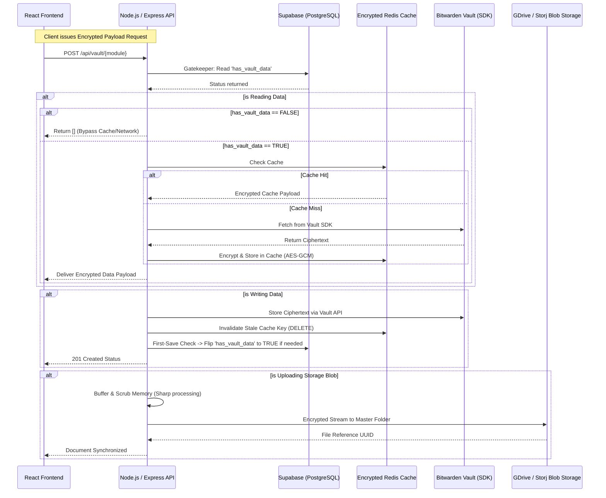

<div align="center">

#  Kryptes: Zero-Knowledge Super App & Vault

*Your ultimate privacy-first decentralized vault for passwords, banking cards, secure files, and beyond.*

### 🛠 Tech Stack


</div>

---

## 📖 Deeply Technical Overview

**Kryptes** is a meticulously engineered, zero-knowledge super-computing application designed from the ground up to protect highly sensitive personal data. From secure credentials and banking cards to heavy encrypted document blobs, Kryptes enforces categorical privacy boundaries using native Client-Side Encryption (CSE) reinforced by robust Backend-Side Encryption (BSE) prior to final storage.

By design, the Node.js backend operates purely on ciphertexts. Under no circumstances does the application architecture permit plaintext secrets to be logged, stored on disk, or transferred to third-party databases. 

---

## 🚀 Architectural Modules & Core Features

Kryptes is divided into specialized modules, unified by a single zero-knowledge encryption pipeline.

### 1. The Banking & Cards Express Vault 💳
- **Strict Validation:** Only accepts structured data handling parameters (Card Numbers, IFSC Codes, custom bank extensions).
- **Secure Handling:** Data is encrypted locally and shuttled via Express directly into a locked **Bitwarden** instance that acts as the primary data persistence layer.
- **Cache-Aside Operations:** Fetches are extremely fast due to encrypted copies residing securely in an in-memory **Redis Cluster**.

### 2. The Identity & Password Manager 🔑
- **Cyber-Noir Design:** A futuristic, categorizable 3D grid layout using Spline mechanics and glassmorphic designs to handle identity.
- **Self-Healing Decryption:** Secrets require an active, validated on-demand master key sequence to be rendered to the user DOM. Without it, secrets remain mathematical blobs.

### 3. The Document Locker 📄
- **Justified Photo/Grid Layout:** Custom-built React hooks process dimensions specifically for images and documents.
- **Conversion Pipeline:** Native backend utilities (Sharp & PDF-lib) process format modifications securely in memory (`pdf -> png`, `webp -> jpeg`) without saving temporal files to disk.
- **Decentralized Storage:** Uses heavily encrypted and verified chunks uploaded to Cloud Storage components (Google Drive Service Accounts / Storj Protocol). 

---

## 🏗️ Advanced Security Architecture & Data Flow

Kryptes does not trust the database. It utilizes **AES-256-GCM** authenticated encryption with unique initialization vectors (IVs) and 64-character hexadecimal caching keys mapping out an impenetrable wall.

### The "Gatekeeper" Database Optimization

To combat unnecessary cold-starts and large network lookups to Bitwarden/Redis for empty accounts, Kryptes employs the **Gatekeeper Check**:

1. **The Check:** A lightweight PostgreSQL lookup targeting the `has_vault_data` boolean flag in Supabase `profiles`.
2. **The Fast Exit:** If `FALSE`, the Express controller instantly aborts the caching chain and returns `[]` with a `200 OK` status, bypassing all memory and storage systems.
3. **The First-Save Flip:** The first time a user successfully inserts securing data, the backend flips `has_vault_data = TRUE`, and the cache begins managing interactions safely from then on.

### Comprehensive Infrastructure Flow



---

## 💻 Environment & Secret Management

Kryptes requires exact 1:1 local replication of variables. The backend utilizes specific caching keys that must be generated identically.

### Crucial Variables (Server / Local / Frontend)
*   **`SUPABASE_URL` / `SUPABASE_ANON_KEY` / `SUPABASE_SERVICE_ROLE_KEY`:** Required for Auth and Database access (Service Role strictly on Backend).
*   **`REDIS_URL`:** URI connecting to the remote Redis cluster handling the active Cache-Aside implementation.
*   **`REDIS_CACHE_KEY`:** A deeply sensitive 32-byte (64 hexadecimal characters) string used inside `cryptoUtils.ts` to encrypt items residing in RAM.
*   **Bitwarden Variables:** `BITWARDEN_API_URL`, `BITWARDEN_TOKEN`, `BW_CLIENT_ID`, `BW_CLIENT_SECRET`.
*   **Blob Storage:** `GDRIVE_MASTER_FOLDER_ID`, `GDRIVE_CLIENT_EMAIL`, and `GDRIVE_PRIVATE_KEY` for handling heavy blobs securely via service accounts.

---

## 🛠️ Complete Installation & Local Setup

Deploying Kryptes requires standing up both ends of the service. Ensure **Node 18+** is installed.

### 1. Clone the Structure
```bash
git clone https://github.com/Kryptes-Vault/Kryptes.git
cd Kryptes
```

### 2. Initialize Packages
```bash
# General Frontend / Package dependencies
npm install

# Build the Backend Architecture dependencies
cd backend && npm install
cd ..
```

### 3. Establish Local Secrets
Create a `.env` in the root folder for Vite/React and a `.env` in the `backend/` directory for Node.js. Supply the necessary credentials based on the templates inside `env_template.md`.

### 4. Ignite the Services
For local development, it is recommended to run two separate shell instances.

**Terminal 1 (Backend Node.js API)**
```bash
cd backend
npm run dev
# The API will be active on http://localhost:4000
```

**Terminal 2 (Frontend React Instance)**
```bash
# In the repository root
npm run dev
# The SPA will be active on http://localhost:5173
```

---

## 🗺️ Verification & Post-Deploy Health Check

Before declaring a build stable, ensure the following critical paths are validated:

- [ ] **OAuth & Sync Integrity:** Sign in with Google providers. Ensure `POST /api/auth/supabase/sync` fires and successfully resolves a cookie session.
- [ ] **Session API Integrity:** Execute `GET /api/auth/me`; verify that JSON data maps identically to your Supabase global session ID.
- [ ] **Gatekeeper Integrity:** Register a new user, navigate to the vault, and examine Network logs. Verify `GET` responses resolve instantly via Gatekeeper bypass without polling Bitwarden.
- [ ] **Data Persistence Check:** Save a new Card to the Banking feature. Refresh the application and ensure the data populates from the Redis Cache layer (watch for `[Cache Hit]` in local Node.js logs).

---

## 📂 System Directory Structure Analysis

```text
Kryptes/
├── backend/                   # Node.js / Express Core Server
│   ├── config/                # Environment, Security limits, CORS
│   ├── controllers/           # Cache-Aside Handlers (bankingController)
│   ├── routes/                # Traffic Handlers (vault.ts, webhook endpoints)
│   ├── services/              # External APIs (Bitwarden, GDrive, SupabaseAdmin, RedisCache)
│   └── utils/                 # Cryptographic implementation (AES-256-GCM generation)
├── src/                       # React / Vite Application (Frontend)
│   ├── components/            # UI Blocks (DocumentLocker, BankingView, Memory Grids)
│   ├── hooks/                 # Synchronous Data Management 
│   ├── pages/                 # Full Routing Views (Dashboard, Settings)
│   ├── lib/                   # Base Level Configurations
│   └── styles/                # Global Tailwind Definitions Framework
├── supabase/                  # Database Edge Functions & Migration Scripts
└── checklists/                # Verification criteria & Deployment manuals
```

---

## 👥 Meet The Kryptes Force

Designed and engineered by a dedicated force of web-security engineers and architects:

*   👑 **Lakshya Chitkul** - Project Lead & Core System Architect
*   👨‍💻 **Prem Sai Kota** - Collaborator & Full-Stack Developer
*   👩‍💻 **Eeshitha Gone** - Collaborator & System Integrator

---
<div align="center">
  <sub>Built with unwavering dedication to security. Kryptes.</sub>
</div>
