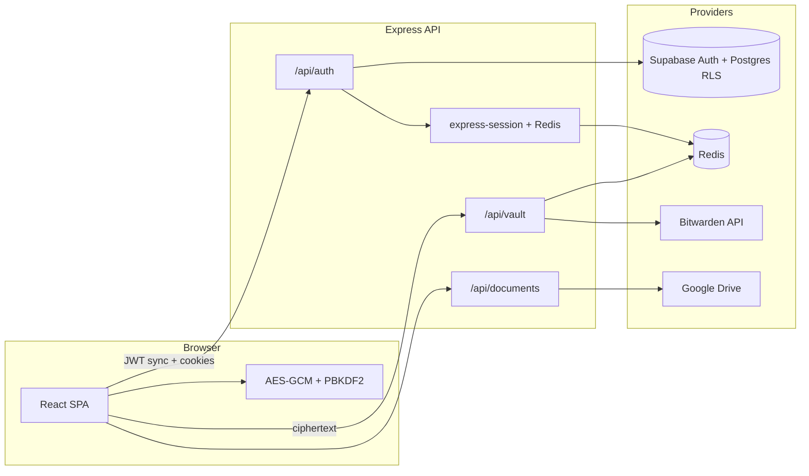
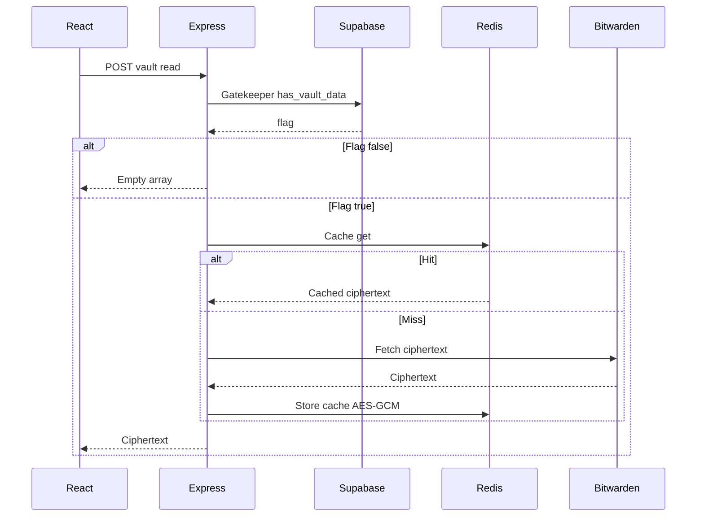
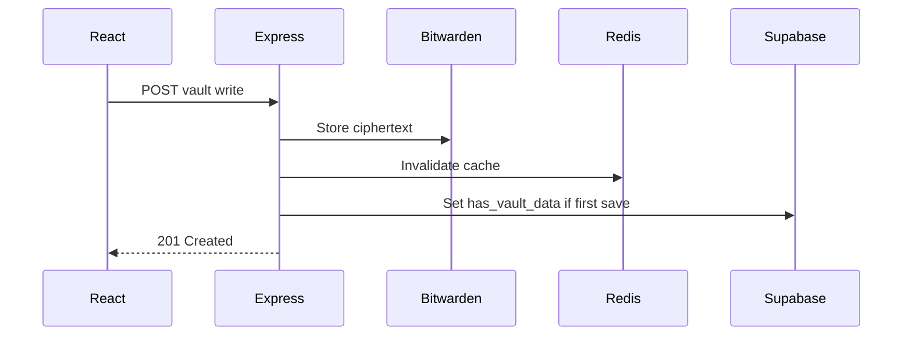
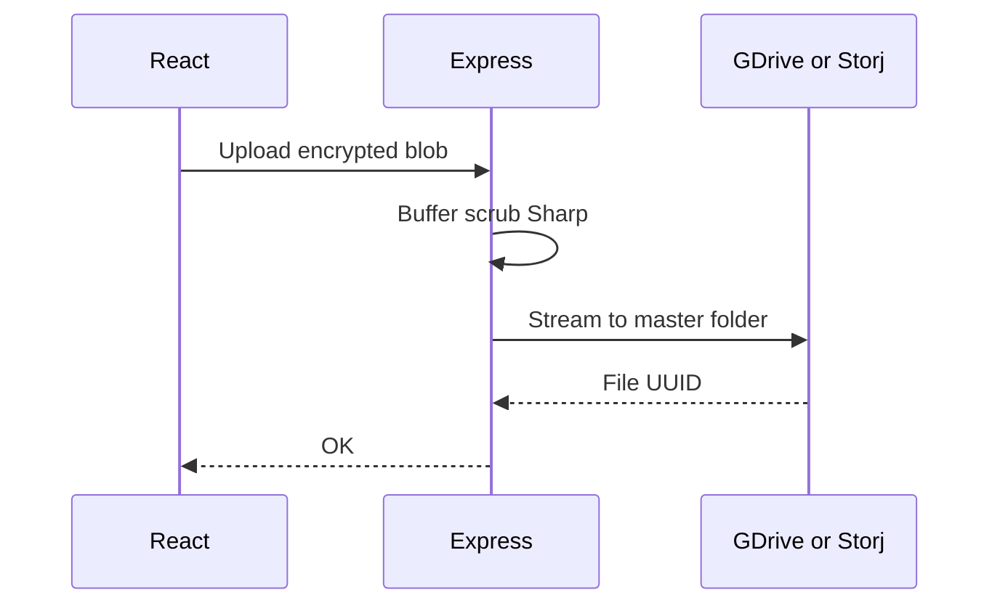

  

<h1 align="center">Kryptes</h1>

  <strong>Zero-knowledge digital vault — passwords, banking, documents, 2FA, and ephemeral sharing.</strong>

  Client-side encryption (AES-256-GCM), Supabase Auth, Redis-backed sessions, optional Bitwarden and Google Drive integrations.

  <a href="#overview">Overview</a> ·
  <a href="#features">Features</a> ·
  <a href="#architecture">Architecture</a> ·
  <a href="#repository-layout">Repository layout</a> ·
  <a href="#backend-api">Backend API</a> ·
  <a href="#environment-variables">Environment</a> ·
  <a href="#local-development">Local development</a> ·
  <a href="#documentation">Documentation</a> ·
  <a href="#contributors">Contributors</a>

---

## Overview

**Kryptes** is a full-stack application (Vite + React SPA, Node/Express API) built around a **“trust no one”** model: vault **plaintext and master passwords stay in the browser**. The API and databases receive **ciphertext**, metadata, and session identifiers — not decryptable secrets.

| Principle | Implementation |
|-----------|----------------|
| **Zero-knowledge payloads** | AES-256-GCM in the browser; PBKDF2 (SHA-256, 100k iterations) derives keys from the master password (see `docs/encryption/vault-crypto-and-redirects.md`). |
| **Identity** | **Supabase Auth** (email/password, Google, Azure/Microsoft, X/Twitter per provider configuration). |
| **Sessions** | **Express** + **connect-redis**; `POST /api/auth/supabase/sync` validates the Supabase JWT server-side and sets `req.session` (see `docs/auth/session-redis-supabase.md`). |
| **Vault sync** | Encrypted blobs routed to **Bitwarden-compatible** flows and **Redis** cache (`backend/routes/vault.ts`, `backend/services/bitwardenService.js`, `backend/services/redisService.js`). |
| **Documents** | **Google Drive** (service account) for Document Locker and related uploads (`backend/services/googleDriveStorage.ts`, `server.ts` `/api/documents/*`). |
| **Ephemeral shares** | Burn-on-read shares via Supabase RPC `get_and_burn_secret` and URL fragment key material (`docs/encryption/ephemeral-sharing.md`). |

The project migrated from **Firebase** to **Supabase**; PostgreSQL + **RLS** protects profile and vault-adjacent data (`docs/platform/supabase-migration-firebase.md`).

---

## Features

### Authentication and session

- Landing sign-up / sign-in via **Supabase**; OAuth redirect uses **`window.location.origin`** so dev ports (e.g. Vite **5173**) and production hosts both work (`docs/encryption/vault-crypto-and-redirects.md`).
- **`/auth/callback`** completes OAuth; the SPA calls **`POST /api/auth/supabase/sync`** with the bearer token to obtain a **Redis-backed session cookie**.
- **`GET /api/auth/me`** exposes the session user shell (see `backend/routes/auth.js`).

### Vault (passwords and cards)

- **Gatekeeper** (`backend/services/gatekeeperService`) uses Supabase profile flags to avoid unnecessary provider calls when a category is empty.
- **POST/GET** vault routes: write-through to **Bitwarden** and cache in **Redis**; banking card flows use dedicated Bitwarden helpers where implemented (`vault.ts`).

### Document Locker

- **GET `/api/documents`** — list documents stored under a configurable Drive “user folder” (logical id via `GDRIVE_DOCUMENTS_USER_ID`, default `kryptes-documents`).
- **POST `/api/documents/upload`** — multipart upload; files stored as **`application/octet-stream`** blobs in Drive.
- **GET `/api/documents/download`** — fetch and optional **format conversion** (e.g. PDF/images) via **sharp** / **pdf-lib** (`server.ts`).
- **DELETE `/api/documents`** — delete by Drive file id.

**Drive setup:** Service account JSON or `GDRIVE_CLIENT_EMAIL` + `GDRIVE_PRIVATE_KEY`; **`GDRIVE_MASTER_FOLDER_ID`** may be a bare folder id or a full **folder URL** (parsed automatically). For uploads, Google often requires a **Shared drive (Team Drive)** folder with the service account as a member — personal “My Drive” sharing alone frequently hits **storage quota** errors for service accounts (`backend/.env.example`, `backend/services/googleDriveStorage.ts`).

### Universal conversion

- **POST `/api/convert`** — image/PDF conversion pipeline (memory limits, `sharp`, `pdf-lib`) for supported formats.

### Webhooks and email

- **Send Email** hook and related routes for Supabase Auth email flows (`backend/routes/authEmailHook.js`, `backend/routes/webhooks.js`, `docs/auth/email-auth-hook.md`).
- Optional **Custom SMTP** and **MAIL_FROM** for transactional mail (`docs/auth/custom-smtp.md`).

### OTP

- **`/api/otp`** routes (`backend/routes/otp.ts`) for OTP flows integrated with the app.

### Health

- **`/ping`**, **`/health`**, **`/health/deep`** for uptime and dependency checks.

### Legal pages (SPA)

- **`/privacy`**, **`/terms`**; static HTML also under `public/` where applicable.

---

## Architecture

High-level data flow:

**Vault, gatekeeper, cache, and blob storage (sequence):**

*GitHub renders Mermaid below. If your editor shows raw code, open this README on **github.com** or enable a Mermaid-capable Markdown preview.*

**Read (gatekeeper + cache + Bitwarden):**

**Write:**

**Blob upload (e.g. documents):**

- **Frontend:** React 18, TypeScript, Vite, Tailwind, Radix UI, TanStack Query, React Router (`src/App.tsx`).
- **Backend:** Express 5, `tsx` entry `backend/server.ts`; mixed **TypeScript** and **JavaScript** routes/services.
- **Auth:** Supabase validates users; **service role** key is **server-only** (`docs/platform/env-cleanup-security.md`).

---

## Tech stack

| Area | Technologies |
|------|----------------|
| **UI** | React, TypeScript, Vite, Tailwind CSS, shadcn/ui (Radix), Framer Motion, Lucide, Sonner |
| **Auth & DB** | Supabase (`@supabase/supabase-js`, SSR helpers as needed) |
| **API** | Express, express-session, connect-redis, ioredis, redis (node-redis), cors, multer, zod |
| **Crypto / media** | sharp, pdf-lib (server); client crypto under `src/lib/crypto/` |
| **Integrations** | googleapis (Drive), axios (Bitwarden), nodemailer, standardwebhooks |
| **Testing** | Vitest, Playwright (dev dependencies) |

Badges (quick scan):

---

## Repository layout

| Path | Role |
|------|------|
| `src/` | Vite React app: `pages/`, `components/`, `lib/` (Supabase client, vault services, crypto) |
| `backend/` | Express app: `server.ts`, `routes/`, `services/`, `config/` |
| `docs/` | Architecture, auth, vault, SMTP, OAuth, checklists, legal drafts (`PRIVACY_POLICY.md`, `TERMS_OF_SERVICE.md`) |
| `supabase/migrations/` | SQL migrations (e.g. profiles, shared secrets, vault-related schema) |
| `public/` | Static assets; app logo at **`public/kryptes.png`** |
| `docs/operations/checklists/` | Supabase, Vercel, Render, post-deploy checklists |

---

## Backend API (summary)

| Method | Path | Purpose |
|--------|------|---------|
| GET | `/ping`, `/health`, `/health/deep` | Liveness / readiness |
| POST | `/api/convert` | File format conversion |
| GET | `/api/documents` | List Document Locker files (Drive) |
| POST | `/api/documents/upload` | Upload document blob |
| GET | `/api/documents/download` | Download / convert |
| DELETE | `/api/documents` | Delete by Drive file id |
| * | `/api/vault/*` | Encrypted vault sync (Bitwarden + Redis) |
| * | `/api/auth/*` | Supabase sync, session, verification helpers |
| * | `/api/webhooks/*` | Auth / integration webhooks |
| * | `/api/otp/*` | OTP endpoints |

Rate limiting applies to selected vault routes (`vault.ts`).

---

## Environment variables

- **Frontend (Vercel or `.env`):** `VITE_SUPABASE_URL`, `VITE_SUPABASE_ANON_KEY`, `VITE_BACKEND_URL` — see **`docs/platform/env-template.md`**.
- **Backend (Render or `backend/.env`):** `SUPABASE_URL`, `SUPABASE_SERVICE_ROLE_KEY`, `REDIS_URL`, `SESSION_SECRET`, `FRONTEND_URL`, email and hook secrets as documented; **Google Drive** keys documented in **`backend/.env.example`**.
- **Supabase dashboard:** redirect URLs and OAuth providers — **`docs/operations/checklists/supabase-dashboard.md`**, **`docs/platform/supabase-migration-firebase.md`**.

Never commit real `.env` files or service account JSON with live keys. Use **`.env.example`** and host-specific secret stores.

---

## Local development

1. **Prerequisites:** Node **≥ 18**, npm or pnpm; Redis (local or cloud URL); Supabase project for auth.
2. **Frontend:** from repo root, `npm install`, then `npm run dev` (Vite, default **http://localhost:5173**).
3. **Backend:** `cd backend && npm install`, copy **`backend/.env.example`** to **`backend/.env`**, fill Supabase, Redis, optional Drive/Bitwarden. Run **`npm run dev`** (tsx watch) — default API **http://localhost:4000**.
4. **CORS / cookies:** Set `FRONTEND_URL` / `VITE_BACKEND_URL` so the browser origin matches your Vite URL; session cookies often need `secure` + `sameSite` in production only.
5. Add your dev origin (e.g. `http://localhost:5173/**`) to **Supabase → Authentication → URL Configuration**.

---

## Deployment (typical)

- **Frontend:** static build (`npm run build`) on **Vercel** (or similar); set `VITE_*` vars per **`docs/operations/checklists/vercel-env.md`**.
- **Backend:** **Render** (or similar Node host); set secrets per **`docs/operations/checklists/render-env.md`**; `render-postbuild` in root `package.json` installs backend dependencies for some hosts.
- After deploy, run through **`docs/operations/checklists/post-deploy.md`**.

---

## Security notes

- **Service role** and **webhook secrets** must stay on the server.
- Vault **ciphertext** is designed to be useless without the user’s master password (client-side).
- **Ephemeral sharing** uses URL fragments for key material where specified; see **`docs/encryption/ephemeral-sharing.md`**.
- Review **`docs/platform/env-cleanup-security.md`** when rotating keys or changing auth.

---

## Documentation

The **`docs/`** folder is the source of truth for deep dives. Start with **`docs/README.md`** (index). Notable entries:

| Topic | Doc |
|-------|-----|
| Firebase → Supabase migration | `docs/platform/supabase-migration-firebase.md` |
| Redis + Supabase session sync | `docs/auth/session-redis-supabase.md` |
| Env template (Vercel / Render) | `docs/platform/env-template.md` |
| Google OAuth via Supabase | `docs/auth/google-oauth-supabase.md` |
| Email hook + SMTP | `docs/auth/email-auth-hook.md`, `docs/auth/custom-smtp.md` |
| Vault crypto & redirects | `docs/encryption/vault-crypto-and-redirects.md` |
| Vault DB schema | `docs/encryption/vault-database-schema.md` |
| Ephemeral sharing | `docs/encryption/ephemeral-sharing.md` |
| Password vault feature | `docs/encryption/password-vault.md` |
| Settings / dashboard | `docs/frontend/settings-dashboard.md` |
| Granular Gatekeeper | `docs/encryption/granular-gatekeeper.md` |
| OTP support grant (design) | `docs/encryption/zero-knowledge-support-grant.md` |
| Twitter / LinkedIn UI (where applicable) | `docs/auth/twitter-oauth-integration.md`, `docs/frontend/linkedin-ui.md` |

---

## Scripts (root `package.json`)

| Script | Command |
|--------|---------|
| Dev server | `npm run dev` |
| Production build | `npm run build` |
| Lint | `npm run lint` |
| Tests | `npm run test` |
| Backend install on host | `npm run render-postbuild` |

Backend: `cd backend && npm run dev` / `npm start` (see `backend/package.json`).

---

## Logo asset

- **File:** `public/kryptes.png` (served at `/kryptes.png` in the Vite app; used for favicon and OG tags in `index.html`).
- **README:** `./public/kryptes.png` — relative to `README.md` so GitHub shows the image on the branch you are viewing (paths are case-sensitive on GitHub; commit this exact filename).

---

## Collaborators

  
  &nbsp;&nbsp;&nbsp;&nbsp;&nbsp;&nbsp;&nbsp;&nbsp;&nbsp;&nbsp;&nbsp;&nbsp;&nbsp;&nbsp;&nbsp;
  
  &nbsp;&nbsp;&nbsp;&nbsp;&nbsp;&nbsp;&nbsp;&nbsp;&nbsp;&nbsp;&nbsp;&nbsp;&nbsp;&nbsp;&nbsp;
  

  <strong>Chitkul Lakshya</strong> &nbsp;&nbsp;&nbsp;&nbsp;&nbsp;&nbsp;&nbsp;&nbsp;&nbsp;&nbsp;&nbsp;&nbsp;&nbsp;&nbsp;&nbsp; <strong>Thanmayee Reddy Kotha</strong> &nbsp;&nbsp;&nbsp;&nbsp;&nbsp;&nbsp;&nbsp;&nbsp;&nbsp;&nbsp;&nbsp;&nbsp;&nbsp;&nbsp;&nbsp; <strong>Eeshitha Gone</strong>
   
  <em>Backend & API Integration</em> &nbsp;&nbsp;&nbsp;&nbsp;&nbsp;&nbsp;&nbsp;&nbsp;&nbsp;&nbsp;&nbsp; <em>Project Lead</em> &nbsp;&nbsp;&nbsp;&nbsp;&nbsp;&nbsp;&nbsp;&nbsp;&nbsp;&nbsp;&nbsp;&nbsp;&nbsp;&nbsp;&nbsp;&nbsp;&nbsp;&nbsp;&nbsp;&nbsp;&nbsp;&nbsp; <em>Design & Frontend</em>

---

## License

This repository is **private** (`package.json`: `"private": true`). If you publish under an open-source license, add a `LICENSE` file and update this section.

---

*Last updated to reflect the Kryptes stack: Supabase Auth, Express + Redis sessions, Bitwarden + Redis vault paths, Google Drive document vault, and the `docs/` specifications listed above.*
