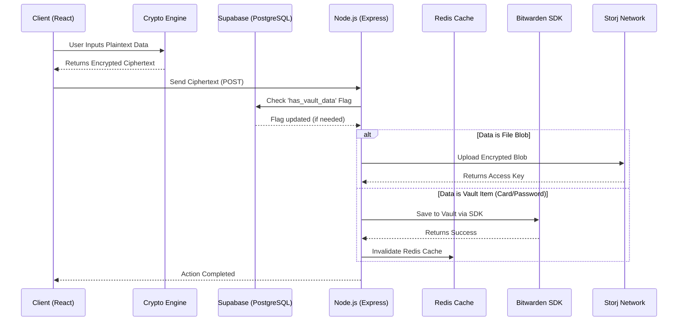

<div align="center">

# 🛡️ Kryptes: Zero-Knowledge Super App & Vault

*Your ultimate privacy-first decentralized vault for passwords, banking cards, and secure files.*

### 🛠 Tech Stack


</div>

---

## 📖 Overview

Kryptes is a zero-knowledge super computing application designed from the ground up to protect your most sensitive personal information. From passwords and identity records to banking cards and heavy file blobs, Kryptes ensures complete privacy through rigorous end-to-end client-side encryption. The backend infrastructure only handles ciphertexts, meaning the core team, server providers, and cloud hosts can never view your plaintext data.

## ✨ Key Features

- **Zero-Knowledge Architecture:** Strict adherence to client-side encryption rules. The server only sees encrypted blobs to manage and store.
- **Gatekeeper Database Flag:** Highly optimized data retrieval utilizing Supabase. A `has_vault_data` flag prevents unnecessary network calls to Redis and Bitwarden for new users.
- **Decentralized File Storage:** Native integration with Storj network to store heavy encrypted file blobs with redundancy out of the box.
- **Encrypted Redis Caching:** Built-in Cache-Aside pattern utilizing AES-256-GCM to securely cache items like passwords and banking details without exposing plaintext to RAM.
- **Automated Backend Vault:** Native bridges into Bitwarden as the backend robust secrets manager.

## 🏗️ Security Architecture & Data Flow

Kryptes leverages a robust and segmented data path.



### Advanced Gatekeeper Fetch Optimization

When pulling vault data:
1. **Gatekeeper Check:** Express requests `has_vault_data` flag from Supabase PostgreSQL.
2. If `FALSE`, exit early and return zero items (skipping all connections to Redis/Bitwarden).
3. If `TRUE`, attempts to read from Redis.
4. On Cache Miss, fetch from Bitwarden, write strictly encrypted objects back to Redis, and deliver data securely.

## 🚀 Installation

Ensure you have **Node.js (v18+)** and **Redis** running locally.

1. **Clone the Repository:**
   ```bash
   git clone https://github.com/Kryptes-Vault/Kryptes.git
   cd Kryptes
   ```

2. **Install Dependencies:**
   ```bash
   # Install frontend components
   npm install
   # Install backend services
   cd backend && npm install
   ```

3. **Configure the Environment:**
   Create `.env` variables for both client and backend (Redis, Supabase keys, encryption seed). See `env_template.md` for schemas.

4. **Start Development Servers:**
   ```bash
   # Start the Express Vault API
   npm run dev:backend
   
   # Start React frontend
   npm run dev
   ```

## 💻 Usage

- **Signing Up:** Users create a global identity on Supabase.
- **The Dashboard:** Navigate to the Vault Section to insert passwords and secrets.
- **Banking Profile:** A specialized container to store encrypted cards.
- **File Locker:** Drag & drop documents that get sliced, padded, encrypted, and relayed to Storj.

## 🗺️ Roadmap

- [x] Initial Express/Node backend bridging & API layout.
- [x] Integrate AES-GCM layer for cryptographic encapsulation.
- [x] Bitwarden integration to handle primary storage.
- [x] Database gatekeeper optimization.
- [ ] Implement fully localized Passkeys / WebAuthn.
- [ ] Complete native mobile (React Native) buildouts.

## 👥 Team

- **Lakshya Chitkul** - Project Lead & Architect
- **Prem Sai Kota** - Collaborator & Developer
- **Eeshitha Gone** - Collaborator & Developer

---
<div align="center">
  <sub>Built with ❤️ and security by the Kryptes Team.</sub>
</div>
