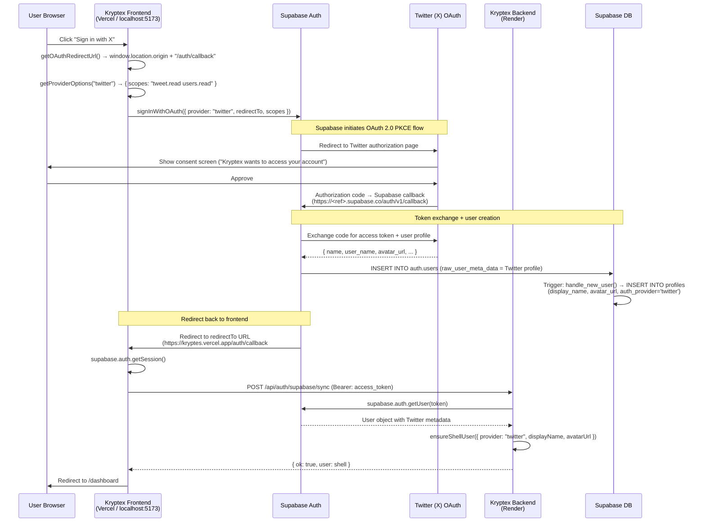
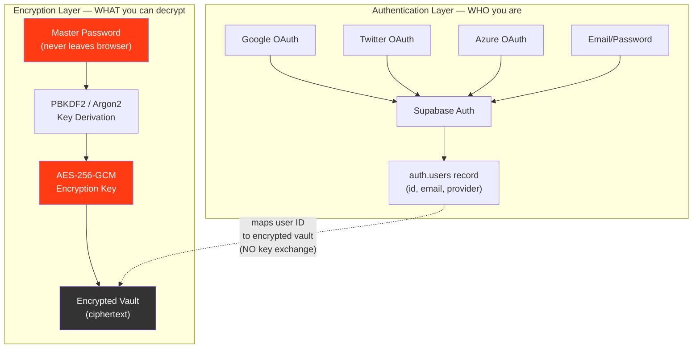

# Kryptex Protocol — Twitter (X) OAuth Integration

> **Document ID:** 34  
> **Date:** 2026-04-06  
> **Classification:** Internal Engineering Protocol  
> **Relates to:** [24_branding_and_handshake_architecture.md](./24_branding_and_handshake_architecture.md), [23_production_auth_debugging.md](./23_production_auth_debugging.md)

---

## 1. Provider Configuration

### Twitter (X) Developer Portal

| Setting | Value |
|---------|-------|
| **Portal URL** | https://developer.x.com/en/portal/dashboard |
| **App Type** | Web App |
| **OAuth 2.0 Type** | Authorization Code with PKCE |
| **Client ID** | `bWw5cElhZ3ZLMGdubWZmQmV3eTM6MTpjaQ` |
| **Client Secret** | Set in `backend/.env` → `TWITTER_CLIENT_SECRET` (never commit) |
| **Callback URL** | `https://yhnonhusmdqeiefherbx.supabase.co/auth/v1/callback` |
| **Website URL** | `https://kryptes.vercel.app` |
| **Terms of Service** | `https://kryptes.vercel.app/terms` |
| **Privacy Policy** | `https://kryptes.vercel.app/privacy` |
| **Permissions (Scopes)** | `tweet.read`, `users.read` |

> [!IMPORTANT]
> The **Callback URL** must point to **Supabase** (`<project-ref>.supabase.co/auth/v1/callback`),
> NOT to your Vercel frontend. Supabase is the OAuth broker — Twitter sends the auth code to Supabase,
> which then redirects the user to your frontend's `redirectTo` URL.

### Supabase Dashboard Configuration

Navigate to: **Supabase Dashboard → Authentication → Providers → Twitter**

| Setting | Value |
|---------|-------|
| **Enabled** | ✅ Toggle ON |
| **Client ID (API Key)** | Paste from Twitter Developer Portal |
| **Client Secret (API Secret)** | Paste from Twitter Developer Portal |

Additionally, verify URL Configuration:

**Supabase Dashboard → Authentication → URL Configuration**

| Setting | Value |
|---------|-------|
| **Site URL** | `https://kryptes.vercel.app` |
| **Redirect URLs** | `https://kryptes.vercel.app/**` |
| | `http://localhost:5173/**` |

---

## 2. OAuth Redirect Flow (Twitter)



### Dynamic `redirectTo` Resolution

The `redirectTo` URL is resolved at runtime using `window.location.origin`:

| Environment | `window.location.origin` | `redirectTo` |
|-------------|--------------------------|--------------|
| Local dev | `http://localhost:5173` | `http://localhost:5173/auth/callback` |
| Vercel prod | `https://kryptes.vercel.app` | `https://kryptes.vercel.app/auth/callback` |
| Vercel preview | `https://kryptes-xxx.vercel.app` | `https://kryptes-xxx.vercel.app/auth/callback` |

Both the production and localhost URLs must be listed in **Supabase → Authentication → Redirect URLs**.

---

## 3. Identity & Profile Mapping

### Twitter User Metadata Structure

When a user signs in with Twitter, Supabase stores the following in `auth.users.raw_user_meta_data`:

```json
{
  "name": "Kryptex Vault",
  "user_name": "kryptex_vault",
  "avatar_url": "https://pbs.twimg.com/profile_images/.../photo.jpg",
  "provider_id": "12345678",
  "full_name": "Kryptex Vault"
}
```

### Provider Metadata Key Comparison

| Field | Google Key | Twitter Key | Azure Key | Email |
|-------|-----------|-------------|-----------|-------|
| Display Name | `full_name` | `name` / `user_name` | `full_name` / `preferred_username` | Email prefix |
| Avatar | `picture` | `avatar_url` | `picture` | None |
| Email | `email` | *(may be null)* | `email` | `email` |

### SQL Trigger Logic

The `handle_new_user()` trigger function (migration `004_multi_provider_profiles.sql`) resolves metadata with a priority cascade:

```sql
-- Display name resolution (first non-null wins)
_display_name := coalesce(
  new.raw_user_meta_data ->> 'full_name',     -- Google, Azure
  new.raw_user_meta_data ->> 'name',          -- Twitter
  new.raw_user_meta_data ->> 'user_name',     -- Twitter handle
  new.raw_user_meta_data ->> 'preferred_username',  -- Azure
  split_part(new.email, '@', 1)               -- Fallback
);

-- Avatar resolution
_avatar_url := coalesce(
  new.raw_user_meta_data ->> 'avatar_url',    -- Twitter
  new.raw_user_meta_data ->> 'picture'         -- Google, Azure
);
```

### Profiles Table Schema (After Migration 004)

| Column | Type | Source |
|--------|------|--------|
| `id` | `uuid` (PK, FK → auth.users) | Supabase auth |
| `display_name` | `text` | Provider metadata |
| `avatar_url` | `text` | Provider metadata |
| `auth_provider` | `text` | `'google'`, `'twitter'`, `'azure'`, `'email'` |
| `created_at` | `timestamptz` | Auto |
| `updated_at` | `timestamptz` | Auto |

---

## 4. Incident Report: `validation_failed: Unsupported provider`

### Symptoms

- Clicking "Sign in with X" on the Kryptex frontend throws: `validation_failed: Unsupported provider`
- The error originates from Supabase Auth, not from Twitter
- Google OAuth works fine; only Twitter is affected

### Root Cause

The Twitter provider was **not enabled** in the Supabase Dashboard. Supabase's `signInWithOAuth()` sends the provider name to the Supabase Auth server, which checks its provider registry. If the provider toggle is OFF, it returns `Unsupported provider` before any redirect occurs.

```
Frontend → supabase.auth.signInWithOAuth({ provider: "twitter" })
         → POST https://<ref>.supabase.co/auth/v1/authorize?provider=twitter
         → Supabase Auth: "twitter" not in enabled providers list
         → 400: { error: "validation_failed", message: "Unsupported provider" }
```

### Resolution Steps

1. **Twitter Developer Portal** (`developer.x.com`):
   - Created OAuth 2.0 app with PKCE flow
   - Set Callback URL to `https://yhnonhusmdqeiefherbx.supabase.co/auth/v1/callback`
   - Enabled `tweet.read` and `users.read` permissions
   - Copied Client ID and Client Secret

2. **Supabase Dashboard** → Authentication → Providers → Twitter:
   - Toggled the provider **ON**
   - Pasted Client ID: `bWw5cElhZ3ZLMGdubWZmQmV3eTM6MTpjaQ`
   - Pasted Client Secret (from `backend/.env`)
   - Saved configuration

3. **Supabase Dashboard** → Authentication → URL Configuration:
   - Verified `https://kryptes.vercel.app/**` in Redirect URLs
   - Added `http://localhost:5173/**` for local dev

4. **Frontend code** — improved error handling in `signInWithProvider()`:
   - Now checks for `Unsupported provider` / `Provider not enabled` errors
   - Surfaces actionable guidance: "Enable it in Supabase Dashboard → Authentication → Providers"

### Prevention

- Added per-provider loading spinner to show which OAuth flow is in progress
- Added provider status logging at backend startup (`[Status] Twitter OAuth: ✓ configured`)

---

## 5. Zero-Knowledge Persistence

### Critical Invariant: Master Password Is the Sole Decryption Key

Adding new authentication providers (Twitter, Azure, etc.) does **NOT** compromise Kryptex's Zero-Knowledge guarantees. Here's why:



### The Architectural Boundary

| Layer | Knowledge | Can Decrypt Vault? |
|-------|-----------|-------------------|
| **Google/Twitter/Azure** | Email, profile pic, display name | ❌ No |
| **Supabase Auth** | User ID, JWT, provider identity | ❌ No |
| **Supabase DB** | Encrypted ciphertext blobs | ❌ No |
| **Render Backend** | Session cookie, user shell (email/name) | ❌ No |
| **User's Browser** | Master password → derived key → plaintext | ✅ **Only here** |

### Why Adding Providers Is Safe

1. **OAuth = Authentication, Not Authorization to Data**: A Twitter token proves "this is @kryptex_vault" — it does NOT provide any cryptographic material for vault decryption.

2. **No Key Material in Transit**: The Master Password is hashed client-side (PBKDF2/Argon2) and the derived key is used locally for AES-256-GCM. The key is **never** sent to Supabase, Render, or any OAuth provider.

3. **Provider Compromise ≠ Vault Compromise**: If a user's Twitter account is hacked, the attacker can authenticate to Kryptex and see encrypted vault entries — but they **cannot decrypt** any content without the Master Password.

4. **Provider Independence**: Users can sign in with any enabled provider. Adding Twitter doesn't change Google's behavior. Users can even link multiple providers to the same Supabase user.

5. **Session Cookie ≠ Encryption Key**: The `kryptex.sid` session cookie on Render only grants API access to encrypted data endpoints. Actual decryption requires the client-derived key, which exists only in browser memory.

---

## 6. Backend Security Audit (Task 3)

### Port Binding & 502 Resolution (Confirmed)

```javascript
// server.js — lines 155-158
const PORT = Number.parseInt(process.env.PORT || "4000", 10);
const BIND_HOST = process.env.BIND_HOST || "0.0.0.0";
const server = app.listen(PORT, BIND_HOST, () => { /* ... */ });
```

- ✅ `process.env.PORT` — uses Render's dynamic port injection
- ✅ `0.0.0.0` — binds all interfaces for load balancer reachability
- ✅ `/ping` — zero-middleware health check for cron-job.org keep-alive
- ✅ Graceful shutdown — `SIGTERM` handler for clean Render instance cycling

### Hook Secret Verification

The `SUPABASE_HOOK_SECRET` is validated at two points:

1. **Startup** — logged with status indicator:
   ```
   [Status] SUPABASE_HOOK_SECRET: ✓ configured
   ```

2. **Runtime** — Standard Webhooks signature verification in `authEmailHook.js`:
   ```javascript
   const secret = hookSecret.replace(/^v1,whsec_/, "");
   const wh = new Webhook(secret);
   const payload = wh.verify(rawBody, req.headers);
   ```

### Environment Variable Checklist

| Variable | Required For | Status |
|----------|-------------|--------|
| `SUPABASE_HOOK_SECRET` | Auth hook signature verification | ✅ Set |
| `SUPABASE_URL` | Admin client, JWT validation | ✅ Set |
| `SUPABASE_SERVICE_ROLE_KEY` | Server-side admin operations | ✅ Set |
| `TWITTER_CLIENT_ID` | Backend reference (Supabase does the OAuth) | ✅ Set |
| `TWITTER_CLIENT_SECRET` | Backend reference | ✅ Set |
| `REDIS_URL` | Session store | ✅ Set |
| `SESSION_SECRET` | Cookie signing | ✅ Set |
| `PORT` | Dynamic (injected by Render) | ✅ Auto |

---

## 7. Files Modified / Created

| File | Change |
|------|--------|
| `src/lib/oauthRedirect.ts` | Multi-provider `getProviderOptions()` with Twitter scopes |
| `src/pages/Index.tsx` | Refactored `signInWithProvider()` with per-provider loading spinners |
| `backend/routes/auth.js` | Multi-provider metadata resolution (Twitter avatar_url, display_name) |
| `backend/services/userShellStore.js` | Added `avatarUrl` field to shell user record |
| `backend/server.js` | Hook secret validation + provider status at startup |
| `supabase/migrations/004_multi_provider_profiles.sql` | **NEW** — avatar_url, auth_provider columns; universal trigger |
| `docs/auth/twitter-oauth-integration.md` | **NEW** — This document |

---

## 8. References

| Resource | Link |
|----------|------|
| Twitter OAuth 2.0 PKCE | https://developer.x.com/en/docs/authentication/oauth-2-0/authorization-code |
| Supabase: Twitter Provider | https://supabase.com/docs/guides/auth/social-login/auth-twitter |
| Supabase: Auth Hooks | https://supabase.com/docs/guides/auth/auth-hooks |
| In-repo: OAuth branding | `docs/frontend/branding-handshake.md` |
| In-repo: Auth debugging | `docs/auth/production-auth-debugging.md` |
| In-repo: OAuth redirect logic | `src/lib/oauthRedirect.ts` |
