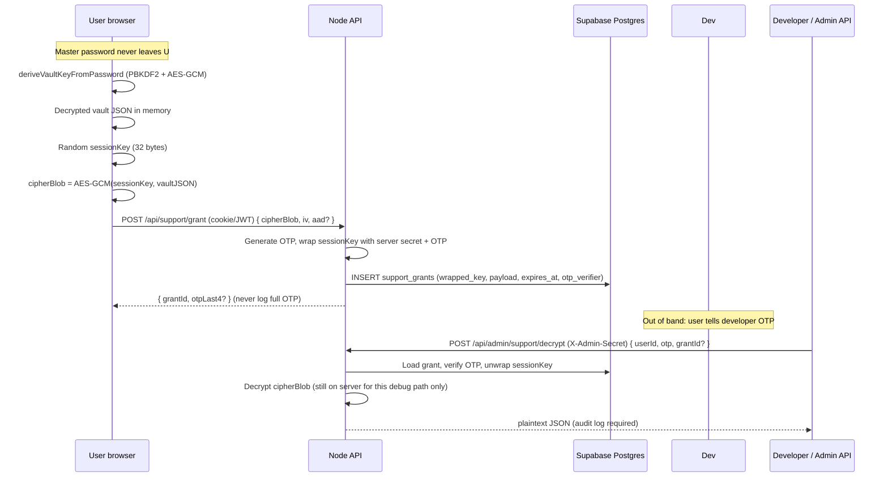

# Zero-Knowledge Vault & OTP Support Grant — Architecture

**Status:** Design specification (Principal Security Architect review).  
**Stack:** React (Web Crypto), Node.js (Express), Supabase (Postgres + Auth).  
**Related:** `src/lib/crypto/vaultCrypto.ts`, `docs/encryption/vault-crypto-and-redirects.md`.

---

## 1. Goals and threat model

| Goal | Requirement |
|------|-------------|
| **Strict zero-knowledge** | Vault plaintext and master password never sent to Node; only ciphertext crosses the wire for normal vault operations. |
| **Support access only by consent** | Developer can read decrypted support payloads **only** when the user initiates a grant **and** provides a short-lived secret (6-digit code) out of band. |
| **Time-bounded** | Developer-access material expires automatically (24h default). |

**Honest limitations**

- A **6-digit numeric OTP** has at most ~20 bits of entropy. It **must not** be the sole root of trust for wrapping keys. This design combines: **server-side pepper**, **per-grant random salt**, **rate limiting**, **single-use or short TTL**, and **no storage of OTP plaintext** (only a slow hash or HMAC for verification).
- **Supabase Auth** does **not** expose a supported API like “generate an arbitrary 6-digit OTP for application key wrapping.” Magic links / email OTP are for **sign-in**, not developer-access key material. This document uses an **application-level OTP** generated on the Node server and (optionally) delivered by your existing email stack. You may **label** it “support code” or “verification code” in the UI to match user expectations.
- Moving “AES from Node to React” for vault data: **your vault crypto already lives in the browser** (`vaultCrypto.ts`). The migration work is **policy + cleanup**: ensure **no** Express route accepts master password or derives vault keys; all encryption/decryption for user vaults uses `useVaultCrypto` (or direct imports from `vaultCrypto.ts`) only.

---

## 2. High-level architecture



**Zero-knowledge note:** Normal production vault sync should keep ciphertext destined for Bitwarden/Drive **only as already client-encrypted**. The **support grant** path is an **explicit exception**: the user opts in to upload a **session-key-encrypted** snapshot so support can decrypt **only** with OTP + server secrets within TTL.

---

## 3. Client-side encryption migration (policy)

### Current state

- `src/lib/crypto/vaultCrypto.ts` already implements **PBKDF2 (100k, SHA-256)** and **AES-256-GCM** in the browser.
- `deriveVaultKeyFromPassword`, `encryptSecretBody`, `decryptSecretBody` are the canonical primitives.

### Migration checklist

1. **Audit** `backend/` for any `encrypt`/`decrypt`/`PBKDF2` related to **user vault bodies**. Remove or gate behind `if (false)` with comments pointing to client-only paths.
2. **Ensure** all vault CRUD from React uses keys derived **only** from the master password path in `vaultCrypto.ts` / `kryptexVaultService.ts`.
3. **Session storage:** avoid persisting master password; derive key in memory per unlock session; zeroize `ArrayBuffer` copies where feasible (`fill(0)` on `Uint8Array` views).

### `useVaultCrypto` hook (TypeScript)

Create e.g. `src/hooks/useVaultCrypto.ts`:

```typescript
import { useCallback, useMemo, useRef, useState } from "react";
import {
  deriveVaultKeyFromPassword,
  encryptSecretBody,
  decryptSecretBody,
  PBKDF2_ITERATIONS,
} from "@/lib/crypto/vaultCrypto";

export type VaultCryptoState = {
  /** True after a key has been successfully derived (password not retained). */
  isUnlocked: boolean;
  /** PBKDF2 salt (persist per user — e.g. Supabase profile or localStorage). */
  saltB64: string | null;
};

/**
 * Strict ZK boundary: master password is only used inside derive callbacks and is not stored.
 * Pass salt from your existing user record; never send password to the server.
 */
export function useVaultCrypto(saltB64: string | null) {
  const keyRef = useRef<CryptoKey | null>(null);
  const [unlocked, setUnlocked] = useState(false);

  const saltBytes = useMemo(() => {
    if (!saltB64) return null;
    const bin = atob(saltB64);
    const out = new Uint8Array(bin.length);
    for (let i = 0; i < bin.length; i++) out[i] = bin.charCodeAt(i);
    return out;
  }, [saltB64]);

  const unlock = useCallback(
    async (masterPassword: string) => {
      if (!saltBytes) throw new Error("Missing vault salt — cannot derive key.");
      const pwd = masterPassword;
      masterPassword = ""; // limit accidental retention in closure scope (best-effort)
      const key = await deriveVaultKeyFromPassword(pwd, saltBytes);
      keyRef.current = key;
      setUnlocked(true);
      return true;
    },
    [saltBytes]
  );

  const lock = useCallback(() => {
    keyRef.current = null;
    setUnlocked(false);
  }, []);

  const encrypt = useCallback(async (plaintextUtf8: string) => {
    const key = keyRef.current;
    if (!key) throw new Error("Vault locked");
    return encryptSecretBody(plaintextUtf8, key);
  }, []);

  const decrypt = useCallback(async (ciphertextB64: string, ivB64: string) => {
    const key = keyRef.current;
    if (!key) throw new Error("Vault locked");
    return decryptSecretBody(ciphertextB64, ivB64, key);
  }, []);

  return {
    isUnlocked: unlocked,
    unlock,
    lock,
    encrypt,
    decrypt,
    iterations: PBKDF2_ITERATIONS,
  };
}
```

**Integration:** Load `saltB64` from the same source your app already uses for `deriveVaultKeyFromPassword` (see `kryptexVaultService.ts` patterns).

---

## 4. Supabase SQL — `support_grants` (24h TTL)

**File:** add `supabase/migrations/007_support_grants.sql` (or next free number).

```sql
-- Developer access (support grant): user-initiated snapshot, OTP-wrapped session key, 24h TTL
-- Access: writes via service role (Node API only). No direct client INSERT.

create extension if not exists "pgcrypto";

create table if not exists public.support_grants (
  id uuid primary key default gen_random_uuid(),
  user_id uuid not null references auth.users (id) on delete cascade,
  -- AES-GCM blob from client: session key encrypts vault JSON
  vault_ciphertext bytea not null,
  vault_iv bytea not null,
  vault_tag bytea not null,
  -- 32-byte random session key, wrapped at rest (see Node crypto); never store plaintext
  wrapped_session_key bytea not null,
  wrap_iv bytea not null,
  wrap_tag bytea not null,
  -- Verification material for the 6-digit support code (e.g. scrypt hash or HMAC)
  otp_verifier bytea not null,
  otp_attempts smallint not null default 0,
  consumed_at timestamptz,
  created_at timestamptz not null default now(),
  expires_at timestamptz not null default (now() + interval '24 hours')
);

create index if not exists support_grants_user_id_idx on public.support_grants (user_id);
create index if not exists support_grants_expires_at_idx on public.support_grants (expires_at);

-- Enforce row TTL at query time; optional cron deletes stale rows
alter table public.support_grants
  add constraint support_grants_expires_future check (expires_at > created_at);

alter table public.support_grants enable row level security;

-- No policy for anon/authenticated direct access — API uses service role only.
-- (Optional) allow users to SELECT own grant metadata without ciphertext via a view — omit for simplicity.

comment on table public.support_grants is 'User-consented support snapshots; decrypted only via admin API + OTP within TTL.';
```

**Automatic expiration**

- **Application:** reject any `SELECT` where `expires_at < now()` or `consumed_at is not null`.
- **Cleanup job:** optional Supabase `pg_cron`:

```sql
-- Requires pg_cron extension; schedule in dashboard
-- delete from public.support_grants where expires_at < now() - interval '1 day';
```

**Security:** Inserts/updates should run only from **Node** with `SUPABASE_SERVICE_ROLE_KEY`, not from the browser with the anon key.

---

## 5. OTP developer access — crypto design (Node)

**Wrapping key** (example — use `crypto` from Node):

```text
salt = random 16 bytes (stored per row in wrap metadata or separate columns)
info = UTF-8("kryptes-support-grant-v1") || userId || grantId
K_wrap = HKDF-SHA256(ikm = SERVER_SUPPORT_PEPPER || otp_utf8, salt, info, length = 32)
wrapped_session_key = AES-256-GCM(K_wrap, sessionKey)
```

- `SERVER_SUPPORT_PEPPER`: long random string in **Render/env only** (32+ bytes).
- **OTP** enters only at wrap time on server after generation; store **`otp_verifier = scrypt(otp, row_salt)`** (or Argon2id) for verification on decrypt — **never store OTP plaintext**.

**Client flow (Grant Support Access button)**

1. User must have unlocked vault (`useVaultCrypto`).
2. Build `vaultJson = JSON.stringify(snapshot)` from in-memory decrypted vault.
3. `sessionKey = crypto.getRandomValues(new Uint8Array(32))` → `CryptoKey` via `subtle.importKey`.
4. Encrypt: `AES-GCM(sessionKey, vaultJson)` → `{ vault_ciphertext, vault_iv, vault_tag }`.
5. Export session key raw: `subtle.exportKey("raw", sessionKey)` → 32 bytes, **send only in TLS** to your API inside JSON body (or wrap session key for transport with a **transient ECDH** if you want no raw key on wire — optional hardening).
6. POST `/api/support/grant` with **session cookie / bearer** + body:

```typescript
// Minimal shape — align with your Express JSON parser
interface SupportGrantRequestBody {
  vaultCiphertextB64: string;
  vaultIvB64: string;
  vaultTagB64: string;
  sessionKeyB64: string; // 32-byte raw, base64 — server must zeroize after wrap
}
```

**Server:** verify Supabase user → generate OTP → derive `K_wrap` → encrypt `sessionKey` into `wrapped_session_key` + IV + tag → store `otp_verifier` → **optionally email OTP** to user via nodemailer → return `{ grantId, expiresAt }` (do **not** return full OTP in response if you email it; if in-app only, show once).

---

## 6. Express routes (TypeScript sketches)

### 6.1 User: create grant — `POST /api/support/grant`

- Middleware: require authenticated session (`req.session.kryptexUser` or JWT pattern you use).
- Body: ciphertext + IV + tag + **session key** (or pre-wrapped variant if you change design).
- Steps: validate sizes (GCM tag 16 bytes, IV 12 bytes), load `user_id`, run wrap + DB insert with service role Supabase client.

### 6.2 Admin: decrypt — `POST /api/admin/support/decrypt`

- Headers: `X-Admin-Secret: <long random from env>` **or** IP allowlist + mTLS in production.
- Body: `{ userId: string, otp: string, grantId?: string }`.
- Steps:
  1. Constant-time compare admin secret.
  2. Load latest valid `support_grants` for `user_id` where `expires_at > now()` and `consumed_at is null`.
  3. Verify OTP against `otp_verifier`; throttle attempts per grant.
  4. Unwrap `sessionKey`, decrypt vault blob, **audit log** access, optionally set `consumed_at = now()`.
  5. Return JSON **only over TLS**; never log plaintext vault in production logs.

**Example Express router** (`backend/routes/supportGrantAdmin.ts`):

```typescript
import { Router, Request, Response } from "express";
import crypto from "node:crypto";
import { createClient } from "@supabase/supabase-js";

const router = Router();

const ADMIN_SECRET = process.env.SUPPORT_ADMIN_SECRET;
const SUPPORT_PEPPER = process.env.SUPPORT_KMS_PEPPER; // 32+ byte secret, base64 or hex in env

function requireAdmin(req: Request, res: Response, next: () => void) {
  const h = req.headers["x-admin-secret"];
  if (!ADMIN_SECRET || typeof h !== "string" || h.length < 32) {
    res.status(401).json({ error: "Unauthorized" });
    return;
  }
  const a = Buffer.from(h, "utf8");
  const b = Buffer.from(ADMIN_SECRET, "utf8");
  if (a.length !== b.length || !crypto.timingSafeEqual(a, b)) {
    res.status(401).json({ error: "Unauthorized" });
    return;
  }
  next();
}

router.post("/support/decrypt", requireAdmin, async (req: Request, res: Response) => {
  try {
    const { userId, otp, grantId } = req.body as {
      userId?: string;
      otp?: string;
      grantId?: string;
    };
    if (!userId || !/^\d{6}$/.test(String(otp || ""))) {
      return res.status(400).json({ error: "userId and 6-digit otp required" });
    }

    const supabase = createClient(
      process.env.SUPABASE_URL!,
      process.env.SUPABASE_SERVICE_ROLE_KEY!
    );

    let q = supabase
      .from("support_grants")
      .select("*")
      .eq("user_id", userId)
      .is("consumed_at", null)
      .gt("expires_at", new Date().toISOString())
      .order("created_at", { ascending: false })
      .limit(1);

    if (grantId) q = q.eq("id", grantId);

    const { data: rows, error } = await q;
    if (error || !rows?.length) {
      return res.status(404).json({ error: "No active grant" });
    }

    const row = rows[0];
    // TODO: verify otp_verifier with scrypt/argon2; unwrap session key; decrypt vault JSON
    // TODO: await supabase.from("support_grants").update({ consumed_at: new Date().toISOString() }).eq("id", row.id)

    return res.status(200).json({
      message: "Implement otp_verifier check + AES unwrap here",
      grantId: row.id,
    });
  } catch (e) {
    console.error("[admin/support/decrypt]", e);
    return res.status(500).json({ error: "Internal error" });
  }
});

export default router;
```

Mount with: `app.use("/api/admin", supportGrantAdminRouter)` and ensure this path is **not** exposed to Vercel — **only** on locked-down API host.

---

## 7. React — “Grant Support Access” button (sketch)

```tsx
import { useState } from "react";
import { useVaultCrypto } from "@/hooks/useVaultCrypto";

export function GrantSupportAccessButton(props: {
  saltB64: string | null;
  getVaultSnapshotJson: () => object; // in-memory decrypted structure
}) {
  const vault = useVaultCrypto(props.saltB64);
  const [busy, setBusy] = useState(false);
  const wc = globalThis.crypto;

  async function onGrant() {
    if (!vault.isUnlocked) {
      alert("Unlock your vault first.");
      return;
    }
    setBusy(true);
    try {
      const raw = new TextEncoder().encode(JSON.stringify(props.getVaultSnapshotJson()));
      const sessionKeyRaw = wc.getRandomValues(new Uint8Array(32));
      const sessionKey = await wc.subtle.importKey(
        "raw",
        sessionKeyRaw,
        { name: "AES-GCM", length: 256 },
        false,
        ["encrypt"]
      );
      const iv = wc.getRandomValues(new Uint8Array(12));
      const ct = new Uint8Array(await wc.subtle.encrypt({ name: "AES-GCM", iv }, sessionKey, raw));
      // Web Crypto GCM: ciphertext includes auth tag at end (16 bytes) — split to match your API contract
      const tag = ct.slice(-16);
      const ciphertext = ct.slice(0, -16);

      const body = {
        vaultCiphertextB64: btoa(String.fromCharCode(...ciphertext)),
        vaultIvB64: btoa(String.fromCharCode(...iv)),
        vaultTagB64: btoa(String.fromCharCode(...tag)),
        sessionKeyB64: btoa(String.fromCharCode(...sessionKeyRaw)),
      };

      const res = await fetch(`${import.meta.env.VITE_BACKEND_URL}/api/support/grant`, {
        method: "POST",
        credentials: "include",
        headers: { "Content-Type": "application/json" },
        body: JSON.stringify(body),
      });
      if (!res.ok) throw new Error(await res.text());
      sessionKeyRaw.fill(0);
      alert("Support grant created. Check your email for the code.");
    } finally {
      setBusy(false);
    }
  }

  return (
    <button type="button" disabled={busy} onClick={() => void onGrant()}>
      {busy ? "Creating grant…" : "Grant Support Access"}
    </button>
  );
}
```

Use **`globalThis.crypto`** for Web Crypto (`getRandomValues`, `subtle`) so it does not collide with the `vault` hook variable.

---

## 8. Implementation steps (ordered)

1. Add migration `007_support_grants.sql`; apply to Supabase staging.
2. Add env vars: `SUPPORT_KMS_PEPPER`, `SUPPORT_ADMIN_SECRET`, document in `docs/platform/env-template.md`.
3. Implement `useVaultCrypto` and refactor vault UI to use it for all encrypt/decrypt paths.
4. Implement `POST /api/support/grant` (Node) with wrap + `otp_verifier` + insert.
5. Implement `POST /api/admin/support/decrypt` with verification + decrypt + audit + `consumed_at`.
6. Add UI button + email template for OTP delivery.
7. Pen-test: brute-force rate limits, TTL bypass, replay of old grants, log leakage.

---

## 9. Compliance and logging

- **Audit:** append-only `support_grant_access_log` (admin user id, grant id, timestamp, IP) without vault plaintext.
- **Retention:** delete decrypted material from memory immediately after response; do not persist plaintext on disk.

---

*This document is a design artifact; wire names and column layouts should match the final migration and code review.*
